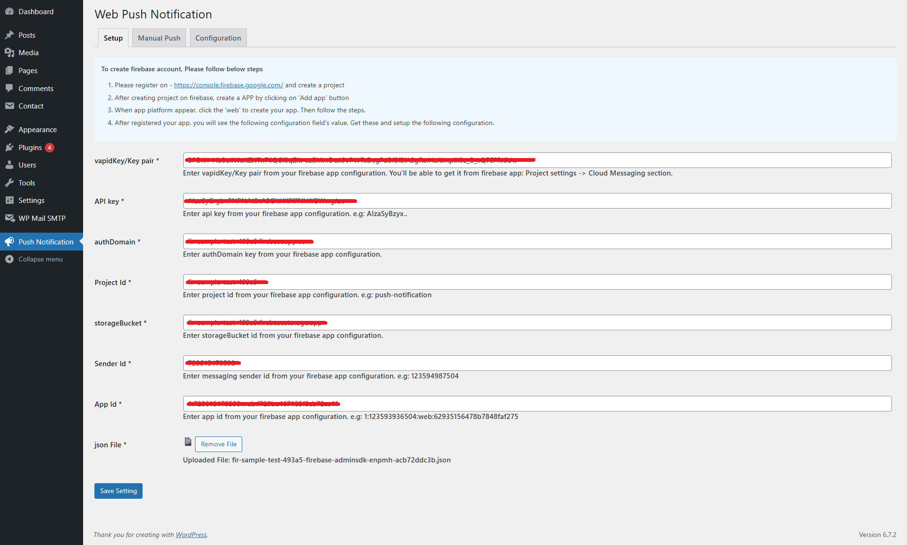
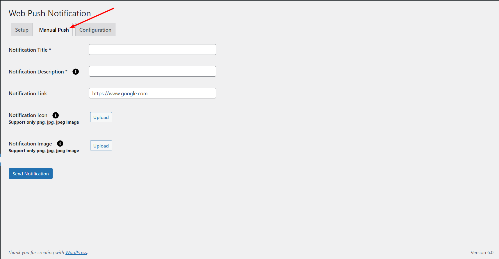
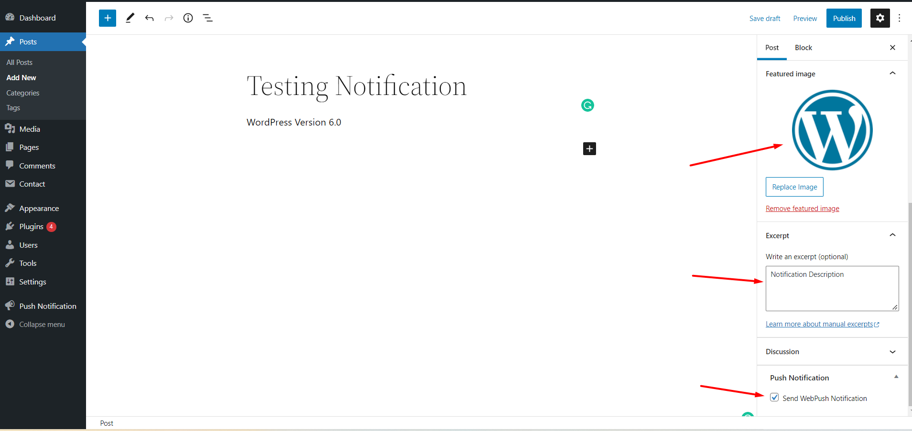
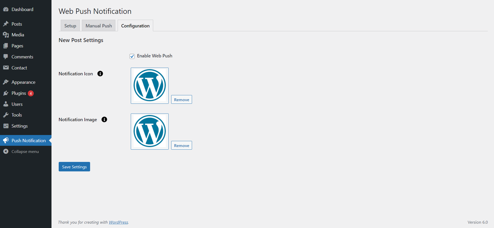

# Push Notifications For Web
Push Notifications For Web, you can send browser push notifications to your site visitors across all popular browsers. Your visitors receive these notifications even when they are not on your site. It only takes a few minutes to install. HTTPS WordPress sites are supported.

Once you have set it up, your site visitors will start seeing opt-in message to receive web push notifications from you. Once they have opted in, you can send them push messages anytime you want.

You can configure the plugin to automatically send push notification to your subscribers any time you publish a new post. You can also also view your subscriber useful user reports (such as browser).

# Installation
1. Download the plugin zip file from WordPress.org plugin site to your desktop / PC
2. If the file is downloaded as a zip archive, extract the plugin folder to your desktop.
3. With your FTP program, upload the plugin folder to the wp-content/plugins folder in your WordPress directory online
4. Go to the Plugin screen and find the newly uploaded Plugin in the list.
5. Click ‘Activate Plugin’ to activate it.

# How To Use
Step 1 : You have to configure it from wp-admin > Push Notification >

You will find a new tab “Push Notification”.

Notification Setup option.

To create firebase account, Please follow below steps
1. Please register on - https://console.firebase.google.com/ and create a project
2. After creating project on firebase, create a APP by clicking on 'Add app' button
3. When app platform appear, click the 'web' to create your app. Then follow the steps.
4. After registered your app, you will see the following configuration field's value. Get these and setup the following configuration.

Send Manual Push 

Configuration New post Settings.

Post and Page Push Notification Option.

# Getting Help

If you have any difficulties while using this Plugin, please feel free to contact us at opensource@zealousweb.com. We also offer custom WordPress extension development and WordPress theme design services to fulfill your objectives. Our professional dy‐ namic WordPress experts provide profound and customer-oriented development of your project within short timeframes. Thank you for choosing a Plugin developed by ZealousWeb!
